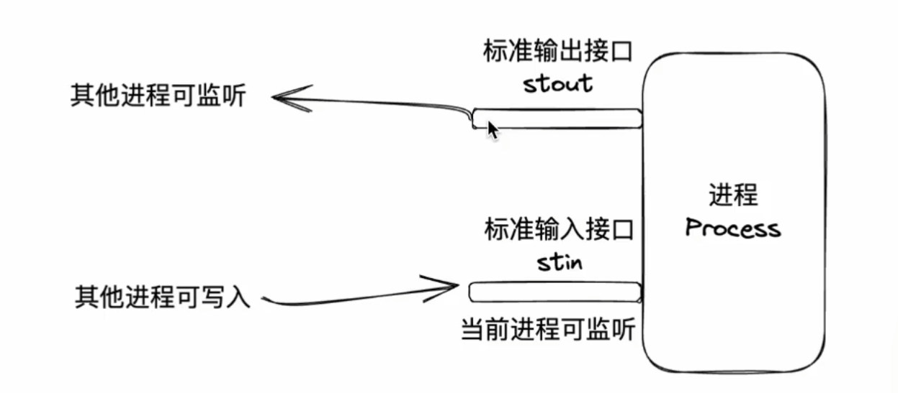
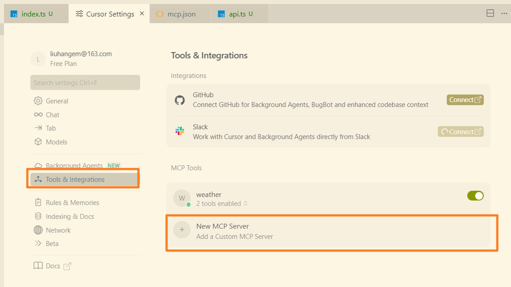

# MCP

[TOC]


## 前置知识


### 通信方式

stdio：standard input and output 标准输入输出




### 通信格式：JSON-RPC(Remote Procedure Call)

[JSON-RPC官网](https://www.jsonrpc.org/specification)

Request

```json
 {"jsonrpc": "2.0", "method": "subtract", "params": [42, 23], "id": 1}
```

Response

```json
 {"jsonrpc": "2.0", "result": 19, "id": 1}
```

## MCP基本概念

MCP，全称Model Context Protocol，模型上下文协议。其旨在为AI与外部程序之间建立通信标准，从而使得外部程序可以被部署到任意AI，也使得AI应用可以使用任意的外部程序。

从技术层面来看：MCP是一套标准协议，它规定了应用程序之间如何通信。

如何通信：

- 通信方式
  - stdio：推荐，高效，简洁，本地
  - http：可远程
- 通信格式：基于JSON-RPC的进一步规范

[MCP官网](https://modelcontextprotocol.io/docs/learn/architecture)

基本规范：

### 生命周期

[生命周期](https://modelcontextprotocol.io/specification/2025-06-18/basic/lifecycle)

模型上下文协议（MCP）为客户端 - 服务器连接定义了严格的生命周期，以确保适当的能力协商和状态管理。

1. **初始化阶段**：能力协商和协议版本确认
2. **操作阶段**：正常的协议通信
3. **关闭阶段**：连接的优雅终止


#### 1.初始化 **initialize**

初始化阶段必须是客户端和服务器之间的第一次交互。 在此阶段，客户端和服务器：

- 建立协议版本兼容性
- 交换和协商能力
- 共享实现细节

客户端**必须**通过发送 `initialize` 请求来启动此阶段，该请求包含：

- 支持协议版本
- 客户端功能
- 客户端实现信息

```json
{
  // JSON-RPC协议版本，这里使用2.0版本
  "jsonrpc": "2.0",
  // 请求的唯一标识符，用于匹配请求和响应
  "id": 1,
  // 方法名称，表示这是初始化请求
  "method": "initialize",
  // 方法参数对象
  "params": {
    // MCP协议版本号，指定使用2024-11-05版本的协议
    "protocolVersion": "2024-11-05",
    // 客户端能力描述对象
    "capabilities": {
      // 关于根目录的能力设置
      "roots": {
        // 表示客户端支持根目录列表变化的通知
        "listChanged": true
      },
      // 采样相关的能力（此处为空对象，表示使用默认设置）
      "sampling": {},
      // 启发式相关的能力（此处为空对象，表示使用默认设置）
      "elicitation": {}
    },
    // 客户端信息对象，描述发送请求的客户端
    "clientInfo": {
      // 客户端内部名称
      "name": "ExampleClient",
      // 客户端显示名称，用于UI展示
      "title": "Example Client Display Name",
      // 客户端版本号
      "version": "1.0.0"
    }
  }
}
```

服务器**必须**提供自己的能力和信息：

```json
{
  // JSON-RPC协议版本，与请求保持一致为2.0版本
  "jsonrpc": "2.0",
  // 响应对应的请求ID，与客户端请求中的id匹配，用于关联请求和响应
  "id": 1,
  // 初始化请求的处理结果对象
  "result": {
    // 服务器支持的MCP协议版本，与客户端请求的版本一致
    "protocolVersion": "2024-11-05",
    // 服务器能力描述对象，表明服务器支持的功能
    "capabilities": {
      // 日志相关的能力（空对象表示支持基础日志功能）
      "logging": {},
      // 提示信息相关的能力
      "prompts": {
        // 表示服务器支持提示信息列表变化的通知
        "listChanged": true
      },
      // 资源相关的能力
      "resources": {
        // 表示服务器支持资源订阅功能
        "subscribe": true,
        // 表示服务器支持资源列表变化的通知
        "listChanged": true
      },
      // 工具相关的能力
      "tools": {
        // 表示服务器支持工具列表变化的通知
        "listChanged": true
      }
    },
    // 服务器信息对象，描述响应请求的服务器
    "serverInfo": {
      // 服务器内部名称
      "name": "ExampleServer",
      // 服务器显示名称，用于UI展示
      "title": "Example Server Display Name",
      // 服务器版本号
      "version": "1.0.0"
    },
    // 给客户端的可选说明信息，可能包含初始化后的操作指引等
    "instructions": "Optional instructions for the client"
  }
}
```

初始化成功后，客户端**必须**发送`initialized`通知，表明已准备好开始正常操作：

```json
{
  "jsonrpc": "2.0",
  "method": "notifications/initialized"
}
```

- 在服务器响应`initialize`请求之前，客户端**不应**发送除**ping 请求**之外的其他请求。
- 在收到`initialized`通知之前，服务器**不应**发送除**ping 请求**和**日志请求**之外的其他请求。

##### 1.1版本协商

在`initialize`请求中，客户端**必须**发送其支持的协议版本。该版本**应**是客户端支持的*最新*版本。

如果服务器支持请求的协议版本，它**必须**以相同的版本响应。否则，服务器**必须**以其支持的另一个协议版本响应。该版本**应**是服务器支持的*最新*版本。

如果客户端不支持服务器响应中的版本，它**应**断开连接。

> [!Note]
>
> 如果使用HTTP，客户端**必须**在后续所有发送到MCP服务器的请求中包含`MCP-Protocol-Version: <protocol-version>`HTTP头。
> 有关详细信息，请参见《传输》中的《协议版本头》部分[/specification/2025-06-18/basic/transports#protocol-version-header)。

##### 1.2能力协商

客户端和服务器的能力确定了会话期间可用的可选协议功能。

主要能力包括：

主要能力包括：

| 类别   | 能力           | 描述                                                         |
| ------ | -------------- | ------------------------------------------------------------ |
| 客户端 | `roots`        | 提供文件系统[根目录](https://modelcontextprotocol.io/specification/2025-06-18/client/roots)的能力 |
| 客户端 | `sampling`     | 支持 LLM[采样](https://modelcontextprotocol.io/specification/2025-06-18/client/sampling)请求 |
| 客户端 | `elicitation`  | 支持服务器[启发](https://modelcontextprotocol.io/specification/2025-06-18/client/elicitation)请求 |
| 客户端 | `experimental` | 描述对非标准实验性功能的支持                                 |
| 服务器 | `prompts`      | 提供[提示模板](https://modelcontextprotocol.io/specification/2025-06-18/server/prompts) |
| 服务器 | `resources`    | 提供可读[资源](https://modelcontextprotocol.io/specification/2025-06-18/server/resources) |
| 服务器 | `tools`        | 公开可调用[工具](https://modelcontextprotocol.io/specification/2025-06-18/server/tools) |
| 服务器 | `logging`      | 发出结构化[日志消息](https://modelcontextprotocol.io/specification/2025-06-18/server/utilities/logging) |
| 服务器 | `completions`  | 支持参数[自动补全](https://modelcontextprotocol.io/specification/2025-06-18/server/utilities/logging) |
| 服务器 | `experimental` | 描述对非标准实验性功能的支持                                 |

能力对象可以描述子能力，例如：

- `listChanged`：支持列表变更通知（针对提示、资源和工具）
- `subscribe`：支持订阅单个项目的变更（仅适用于资源）

#### 2.操作

在操作阶段，客户端和服务器根据协商好的能力交换消息。

双方**必须**：

- 遵守协商好的协议版本
- 仅使用成功协商的能力

#### 3.关闭

在关闭阶段，一方（通常是客户端）干净地终止协议连接。没有定义特定的关闭消息，而是应使用底层传输机制来发出连接终止的信号：

##### 标准输入输出（stdio）

对于标准输入输出[传输方式](https://modelcontextprotocol.io/specification/2025-06-18/basic/transports)，客户端**应**通过以下方式启动关闭：

1. 首先，关闭到子进程（服务器）的输入流
2. 等待服务器退出，或者如果服务器在合理时间内未退出，则发送`SIGTERM`信号
3. 如果服务器在发送`SIGTERM`信号后的合理时间内仍未退出，则发送`SIGKILL`信号

服务器**可以**通过关闭其到客户端的输出流并退出的方式启动关闭。

##### HTTP

对于 HTTP[传输方式](https://modelcontextprotocol.io/specification/2025-06-18/basic/transports)，关闭通过关闭相关的 HTTP 连接来表示。

#### 4.超时

实现**应**为所有发送的请求设置超时，以防止连接挂起和资源耗尽。当请求在超时时间内未收到成功或错误响应时，发送方**应**发出针对该请求的[取消通知](https://modelcontextprotocol.io/specification/2025-06-18/basic/utilities/cancellation)，并停止等待响应。

SDKs 和其他中间件**应**允许针对每个请求配置这些超时。

当收到与请求对应的[进度通知](https://modelcontextprotocol.io/specification/2025-06-18/basic/utilities/progress)时，实现**可以**选择重置超时时钟，因为这意味着确实在进行工作。然而，无论是否收到进度通知，实现**都应**始终强制执行最大超时，以限制行为异常的客户端或服务器的影响。

#### 5.错误处理

实现**应**准备好处理以下错误情况：

- 协议版本不匹配
- 协商所需能力失败
- 请求[超时](https://modelcontextprotocol.io/specification/2025-06-18/basic/lifecycle#timeouts)

初始化错误示例：

```json
{
  "jsonrpc": "2.0",
  "id": 1,
  "error": {
    "code": -32602,
    "message": "Unsupported protocol version",
    "data": {
      "supported": ["2024-11-05"],
      "requested": "1.0.0"
    }
  }
}
```

## 服务器能力

### 工具tools

模型上下文协议（MCP）允许服务器公开可由语言模型调用的工具。工具能让模型与外部系统进行交互，例如查询数据库、调用 API 或执行计算。每个工具都通过名称唯一标识，并包含描述其架构的元数据。

#### 1.用户交互模型

MCP 中的工具设计为**模型控制型**，这意味着语言模型可以根据其上下文理解和用户的提示，自动发现并调用工具。

不过，实现方可以通过任何适合其需求的接口模式来公开工具 —— 协议本身并不强制要求特定的用户交互模型。

> [!warning]
>
> 为了信任与安全以及保障安全性，**必须**始终有人类参与其中，并有能力拒绝工具调用。
>
> 应用程序**应当**：
>
> - 提供清晰展示向 AI 模型公开哪些工具的用户界面
> - 在工具被调用时插入明确的视觉指示
> - 对于操作向用户呈现确认提示，以确保有人类参与流程

#### 2.功能

支持工具的服务器**必须**声明`tools`功能：

```json
{
  "capabilities": {
    "tools": {
      "listChanged": true
    }
  }
}
```

`listChanged`表示当可用工具列表发生变化时，服务器是否会发出通知。

#### 3.协议消息

##### 3.1列出工具

为了发现可用工具，客户端发送`tools/list`请求。此操作支持[分页](https://modelcontextprotocol.io/specification/2025-06-18/server/utilities/pagination)。

**请求：**

```json
{
  "jsonrpc": "2.0",
  "id": 1,
  "method": "tools/list",
  "params": {
    "cursor": "optional-cursor-value"
  }
}
```

**响应：**

```json
{
  "jsonrpc": "2.0",
  "id": 1,
  "result": {
    "tools": [
      {
        "name": "get_weather",
        "title": "天气信息提供器",
        "description": "获取某个地点的当前天气信息",
        "inputSchema": {
          "type": "object",
          "properties": {
            "location": {
              "type": "string",
              "description": "城市名称或邮政编码"
            }
          },
          "required": ["location"]
        }
      }
    ],
    "nextCursor": "next-page-cursor"
  }
}
```

##### 3.2调用工具

要调用工具，客户端发送`tools/call`请求：

**请求：**

```json
{
  "jsonrpc": "2.0",
  "id": 2,
  "method": "tools/call",
  "params": {
    "name": "get_weather",
    "arguments": {
      "location": "纽约"
    }
  }
}
```

**响应：**

```json
{
  "jsonrpc": "2.0",
  "id": 2,
  "result": {
    "content": [
      {
        "type": "text",
        "text": "纽约当前天气：\n温度：72°F\n天气状况：局部多云"
      }
    ],
    "isError": false
  }
}
```

##### 3.3列表变更通知

当可用工具列表发生变化时，声明了`listChanged`功能的服务器**应当**发送通知：

```json
{
  "jsonrpc": "2.0",
  "method": "notifications/tools/list_changed"
}
```

#### 4.消息流程


#### 5.数据类型

##### 5.1工具

工具定义包括：

- `name`：工具的唯一标识符
- `title`：可选的、用于显示的人类可读工具名称。
- `description`：功能的人类可读描述
- `inputSchema`：定义预期参数的 JSON 架构
- `outputSchema`：可选的、定义预期输出结构的 JSON 架构
- `annotations`：描述工具行为的可选属性

> [!warning]
>
> 为了信任与安全以及保障安全性，客户端**必须**将工具注释视为不可信内容，除非它们来自可信服务器。

##### 5.2工具结果

工具结果可能包含[**结构化**](https://modelcontextprotocol.io/specification/2025-06-18/server/tools#structured-content)或**非结构化**内容。

**非结构化**内容在结果的`content`字段中返回，并且可以包含多个不同类型的内容项：

> [!Note]
> 所有内容类型（文本、图像、音频、资源链接和嵌入式资源）都支持可选的[注释](https://modelcontextprotocol.io/specification/2025-06-18/server/resources#annotations)，这些注释提供关于受众、优先级和修改时间的元数据。这与资源和提示所使用的注释格式相同。

###### 5.2.1文本内容

```json
{
  "type": "text",
  "text": "工具结果文本"
}
```

###### 5.2.2图像内容

```json
{
  "type": "image",
  "data": "base64编码的数据",
  "mimeType": "image/png",
  "annotations": {
    "audience": ["user"],
    "priority": 0.9
  }

}
```

此示例展示了可选注释的使用。

###### 5.2.3音频内容

```json
{
  "type": "audio",
  "data": "base64编码的音频数据",
  "mimeType": "audio/wav"
}
```

###### 5.2.4资源链接

工具**可以**返回指向[资源](https://modelcontextprotocol.io/specification/2025-06-18/server/resources)的链接，以提供额外的上下文或数据。在这种情况下，工具将返回一个客户端可以订阅或获取的 URI：

```json
{
  "type": "resource_link",
  "uri": "file:///project/src/main.rs",
  "name": "main.rs",
  "description": "主要应用程序入口点",
  "mimeType": "text/x-rust",
  "annotations": {
    "audience": ["assistant"],
    "priority": 0.9
  }
}
```

资源链接支持与常规资源相同的[资源注释](https://modelcontextprotocol.io/specification/2025-06-18/server/resources#annotations)，以帮助客户端了解如何使用它们。

> [!Tip]
>
> 工具返回的资源链接不保证会出现在`resources/list`请求的结果中。

###### 5.2.5嵌入式资源

[资源](https://modelcontextprotocol.io/specification/2025-06-18/server/resources)**可以**通过合适的[URI 方案](https://modelcontextprotocol.io/specification/2025-06-18/server/resources#common-uri-schemes)进行嵌入式处理，以提供额外的上下文或数据。使用嵌入式资源的服务器**应当**实现`resources`功能

```json
{
  "type": "resource",
  "resource": {
    "uri": "file:///project/src/main.rs",
    "title": "项目Rust主文件",
    "mimeType": "text/x-rust",
    "text": "fn main() {\n    println!(\"Hello world!\");\n}",
    "annotations": {
      "audience": ["user", "assistant"],
      "priority": 0.7,
      "lastModified": "2025-05-03T14:30:00Z"
    }
  }
}
```

嵌入式资源支持与常规资源相同的[资源注释](https://modelcontextprotocol.io/specification/2025-06-18/server/resources#annotations)，以帮助客户端了解如何使用它们。

###### 5.2.6 结构化内容

**结构化**内容在结果的`structuredContent`字段中作为 JSON 对象返回。

为了向后兼容，返回结构化内容的工具应当在 TextContent 块中也返回序列化的 JSON。

###### 5.2.7输出架构

工具也可以提供用于验证结构化结果的输出架构。
如果提供了输出架构：

- 服务器**必须**提供符合此架构的结构化结果。
- 客户端**应当**根据此架构验证结构化结果。

带有输出架构的工具示例：

```json
{
  "name": "get_weather_data",
  "title": "天气数据检索器",
  "description": "获取某个地点的当前天气数据",
  "inputSchema": {
    "type": "object",
    "properties": {
      "location": {
        "type": "string",
        "description": "城市名称或邮政编码"
      }
    },
    "required": ["location"]
  },
  "outputSchema": {
    "type": "object",
    "properties": {
      "temperature": {
        "type": "number",
        "description": "温度（摄氏度）"
      },
      "conditions": {
        "type": "string",
        "description": "天气状况描述"
      },
      "humidity": {
        "type": "number",
        "description": "湿度百分比"
      }
    },
    "required": ["temperature", "conditions", "humidity"]
  }
}
```

此工具的有效响应示例：

```json
{
  "jsonrpc": "2.0",
  "id": 5,
  "result": {
    "content": [
      {
        "type": "text",
        "text": "{\"temperature\": 22.5, \"conditions\": \"局部多云\", \"humidity\": 65}"
      }
    ],
    "structuredContent": {
      "temperature": 22.5,
      "conditions": "局部多云",
      "humidity": 65
    }
  }
}
```

提供输出架构通过以下方式帮助客户端和 LLM 理解并正确处理结构化工具输出：

- 支持对响应进行严格的架构验证
- 提供类型信息，以便更好地与编程语言集成
- 指导客户端和 LLM 正确解析和利用返回的数据
- 支持更好的文档和开发者体验

#### 6.错误处理

工具使用两种错误报告机制：

1. **协议错误**：标准 JSON-RPC 错误，用于处理以下问题：
   - 未知工具
   - 无效参数
   - 服务器错误
2. **工具执行错误**：在工具结果中以`isError: true`报告：
   - API 失败
   - 无效输入数据
   - 业务逻辑错误

协议错误示例:

```json
{
  "jsonrpc": "2.0",
  "id": 3,
  "error": {
    "code": -32602,
    "message": "未知工具：invalid_tool_name"
  }
}
```

工具执行错误示例：

```json
{
  "jsonrpc": "2.0",
  "id": 4,
  "result": {
    "content": [
      {
        "type": "text",
        "text": "获取天气数据失败：API速率限制已超出"
      }
    ],
    "isError": true
  }
}
```

#### 7.安全注意事项

1. 服务器**必须**：
   - 验证所有工具输入
   - 实现适当的访问控制
   - 对工具调用进行速率限制
   - 对工具输出进行 sanitize 处理
2. 客户端**应当**：
   - 对敏感操作提示用户确认
   - 在调用服务器之前向用户显示工具输入，以避免恶意或意外的数据泄露
   - 在将工具结果传递给 LLM 之前进行验证
   - 为工具调用实现超时机制
   - 记录工具使用情况以用于审计目的

## 开发工具

### MCP Server的调试工具

在终端中运行下列命令：

```bash
npx @modelcontextprotocol/inspector
```

### MCP SDK

[搭建MCP Server](https://modelcontextprotocol.io/quickstart/server)

#### 执行命令搭建开发环境

```bash
# Initialize a new npm project
npm init -y

# Install dependencies
npm install @modelcontextprotocol/sdk zod
npm install -D @types/node typescript

# Create our files
md src
new-item src\index.ts
```

配置`package.json`文件：

```json
{
  "name": "use-sdk",
  "version": "1.0.0",
  "description": "学习mcp-sdk的demo项目",
  "main": "index.js",
  "type": "module",
  "bin": {
    "weather": "./build/index.js"
  },
  "scripts": {
    "build": "tsc && chmod 755 build/index.js"
  },
  "files": [
    "build"
  ],
  "keywords": [],
  "author": "",
  "license": "ISC",
  "dependencies": {
    "@modelcontextprotocol/sdk": "^1.17.4",
    "zod": "^3.25.76"
  },
  "devDependencies": {
    "@types/node": "^24.3.0",
    "typescript": "^5.9.2"
  }
}
```

配置`tsconfig.json`

```json
{
  "compilerOptions": {
    "target": "ES2022",
    "module": "Node16",
    "moduleResolution": "Node16",
    "outDir": "./build",
    "rootDir": "./src",
    "strict": true,
    "esModuleInterop": true,
    "skipLibCheck": true,
    "forceConsistentCasingInFileNames": true
  },
  "include": ["src/**/*"],
  "exclude": ["node_modules"]
}

```

#### 搭建MCP Server

##### 1.引入相关依赖并配置实例

将这些添加到 `src/index.ts` ：

```ts
import { McpServer } from "@modelcontextprotocol/sdk/server/mcp.js";
import { StdioServerTransport } from "@modelcontextprotocol/sdk/server/stdio.js";
import { z } from "zod";

const NWS_API_BASE = "https://api.weather.gov";
const USER_AGENT = "weather-app/1.0";

// Create server instance
const server = new McpServer({
  name: "weather",
  version: "1.0.0",
  capabilities: {
    resources: {},
    tools: {},
  },
});
```

##### 2.编写相应的辅助函数

添加用于查询和格式化国家气象服务API数据的辅助函数：

**将这些添加到``src/types.ts`:**

```ts
// 天气数据类型定义：对应 NWS API 的响应结构

/** 天气预警要素：包含事件、区域、严重程度等属性（可能缺省） */
export interface AlertFeature {
  properties: {
    event?: string;
    areaDesc?: string;
    severity?: string;
    status?: string;
    headline?: string;
  };
}
/**
 * 预报时段：描述某一时间段的天气概要信息
 * 如名称、温度、风力与简要预报
 */
export interface ForecastPeriod {
  name?: string;
  temperature?: number;
  temperatureUnit?: string;
  windSpeed?: string;
  windDirection?: string;
  shortForecast?: string;
}

/** 天气预警响应：由多条预警要素构成 */
export interface AlertsResponse {
  features: AlertFeature[];
}

/** 位置点查询响应：包含用于获取预报的链接等 */
export interface PointsResponse {
  properties: {
    forecast?: string;
  };
}

/** 天气预报响应：包含多个连续的预报时段 */
export interface ForecastResponse {
  properties: {
    periods: ForecastPeriod[];
  };
}

```

**将这些添加到`src/api.ts`：**

```ts
// NWS API 调用与数据格式化工具函数
const USER_AGENT = "weather-app/1.0";
import {
  AlertFeature,
  AlertsResponse,
  PointsResponse,
  ForecastResponse,
  ForecastPeriod,
} from "./types.js";
/**
 * 通用请求函数：向 NWS API 发送请求
 * @param url 请求地址
 * @returns 解析后的 JSON 对象；若出错返回 null
 */
async function makeNWSRequest<T>(url: string): Promise<T | null> {
  const headers = {
    "User-Agent": USER_AGENT,
    Accept: "application/geo+json",
  };

  try {
    const response = await fetch(url, { headers });
    if (!response.ok) {
      throw new Error(`HTTP error! status: ${response.status}`);
    }
    return (await response.json()) as T;
  } catch (error) {
    console.error("Error making NWS request:", error);
    return null;
  }
}

// 格式化 alert 数据
/**
 * 将单条预警数据要素格式化为可读文本
 * @param feature 预警要素
 * @returns 多行字符串，包含事件、区域、严重程度等
 */
function formatAlert(feature: AlertFeature): string {
  const props = feature.properties;
  return [
    `Event: ${props.event || "Unknown"}`,
    `Area: ${props.areaDesc || "Unknown"}`,
    `Severity: ${props.severity || "Unknown"}`,
    `Status: ${props.status || "Unknown"}`,
    `Headline: ${props.headline || "No headline"}`,
    "---",
  ].join("\n");
}

```

##### 3.实现工具执行

修改`src/index.ts`文档，添加工具注册：

```ts
// MCP 天气服务：通过 stdio 运行的最简示例
import { McpServer } from "@modelcontextprotocol/sdk/server/mcp.js";
import { StdioServerTransport } from "@modelcontextprotocol/sdk/server/stdio.js";
import { z } from "zod";
import { makeNWSRequest, formatAlert } from "./api.js";
import {
  AlertsResponse,
  PointsResponse,
  ForecastResponse,
  ForecastPeriod,
} from "./types.js";

// NWS API 基地址（可按需使用）
const NWS_API_BASE = "https://api.weather.gov";
// 创建 MCP 服务器实例并声明能力
const server = new McpServer({
  name: "weather",
  version: "1.0.0",
  capabilities: {
    resources: {},
    tools: {},
  },
});

// 注册天气工具
server.tool(
  "get_alerts",
  "Get weather alerts for a state",
  {
    state: z.string().length(2).describe("Two-letter state code (e.g. CA, NY)"),
  },
  async ({ state }) => {
    const stateCode = state.toUpperCase();
    const alertsUrl = `${NWS_API_BASE}/alerts?area=${stateCode}`;
    const alertsData = await makeNWSRequest<AlertsResponse>(alertsUrl);

    if (!alertsData) {
      return {
        content: [
          {
            type: "text",
            text: "Failed to retrieve alerts data",
          },
        ],
      };
    }

    const features = alertsData.features || [];
    if (features.length === 0) {
      return {
        content: [
          {
            type: "text",
            text: `No active alerts for ${stateCode}`,
          },
        ],
      };
    }

    const formattedAlerts = features.map(formatAlert);
    const alertsText = `Active alerts for ${stateCode}:\n\n${formattedAlerts.join(
      "\n"
    )}`;

    return {
      content: [
        {
          type: "text",
          text: alertsText,
        },
      ],
    };
  }
);

server.tool(
  "get_forecast",
  "Get weather forecast for a location",
  {
    latitude: z.number().min(-90).max(90).describe("Latitude of the location"),
    longitude: z
      .number()
      .min(-180)
      .max(180)
      .describe("Longitude of the location"),
  },
  async ({ latitude, longitude }) => {
    // Get grid point data
    const pointsUrl = `${NWS_API_BASE}/points/${latitude.toFixed(
      4
    )},${longitude.toFixed(4)}`;
    const pointsData = await makeNWSRequest<PointsResponse>(pointsUrl);

    if (!pointsData) {
      return {
        content: [
          {
            type: "text",
            text: `Failed to retrieve grid point data for coordinates: ${latitude}, ${longitude}. This location may not be supported by the NWS API (only US locations are supported).`,
          },
        ],
      };
    }

    const forecastUrl = pointsData.properties?.forecast;
    if (!forecastUrl) {
      return {
        content: [
          {
            type: "text",
            text: "Failed to get forecast URL from grid point data",
          },
        ],
      };
    }

    // Get forecast data
    const forecastData = await makeNWSRequest<ForecastResponse>(forecastUrl);
    if (!forecastData) {
      return {
        content: [
          {
            type: "text",
            text: "Failed to retrieve forecast data",
          },
        ],
      };
    }

    const periods = forecastData.properties?.periods || [];
    if (periods.length === 0) {
      return {
        content: [
          {
            type: "text",
            text: "No forecast periods available",
          },
        ],
      };
    }

    // Format forecast periods
    const formattedForecast = periods.map((period: ForecastPeriod) =>
      [
        `${period.name || "Unknown"}:`,
        `Temperature: ${period.temperature || "Unknown"}°${
          period.temperatureUnit || "F"
        }`,
        `Wind: ${period.windSpeed || "Unknown"} ${period.windDirection || ""}`,
        `${period.shortForecast || "No forecast available"}`,
        "---",
      ].join("\n")
    );

    const forecastText = `Forecast for ${latitude}, ${longitude}:\n\n${formattedForecast.join(
      "\n"
    )}`;

    return {
      content: [
        {
          type: "text",
          text: forecastText,
        },
      ],
    };
  }
);
async function main() {
  // 创建一个标准输入输出服务器对象
  const transport = new StdioServerTransport();
  // 连接服务器
  await server.connect(transport);
  console.error("Weather MCP Server running on stdio");
}

main().catch((error) => {
  console.error("Fatal error in main():", error);
  process.exit(1);
});

```

##### 4.使用inspector调试

在根目录下执行命令：

```bash
npm run build
npx @modelcontextprotocol/inspector
```


##### 5.将MCP工具配置到cursor

cursor效果：




# 项目实战

## MCP项目实战-安全依赖审计工具

安全以来审计是针对某个工程的所有直接依赖和间接依赖进行安全验证，发现其是否包含潜在风险。

### 何时会进行安全审计

- 技术选型阶段：
  - 针对目标技术
  - 远程审计
- 项目开发阶段：
  - 针对当前工程
  - 本地审计/远程审计

### 如何进行安全审计

```bash
npm audit
```

### 为什么不直接使用npm audit

`npm audit`的问题：

- 阅读不太友好
  - 依赖关系不清晰
- 功能不完整
  - 无法对远程仓库进行审计
  - 无法对工程本身进行审计（只能审计依赖）
- 难以集成
  - AI应用集成：取决于应用是否支持运行命令
  - CI/CD集成：无法定义部署决策逻辑

### 需求

自定义安全审计功能，该功能可支持：

- 对本地工程或远程仓库均能进行安全审计
- 安全审计时能够对工程本身继续进行审计
- 审计结果中包含清晰的依赖路径
- 审计的结果时一个统一标准的`markdown`文档
- 支持`MCP Server`协议
- 更多的扩展功能....

### MVP版本实现流程

大致分为两部分实现功能：

1.实现安全审计功能本身

```js
```

2.将该功能套壳为`MCP Server`

### 安全审计功能的实现流程

1. 创建工作目录:创建一个临时的工作目录,用于保存执行期间要用到的临时文件
2. 解析工程:解析本地工程目录或者远程仓库链接,得到对应的`pacakge.json`文件内容
3. 生成lock文件:将`pacakge.json`写入到临时工作目录,同时根据它生成`pacakge-lock.json`
4. 安全审计:进入到临时工作目录,使用`npm audit`命令进行安全审计,并讲审计结果规格化
5. 渲染:将上一步得到的规格化审计结果进行渲染，渲染成标准化的`markdown`内容,并保存到结果文件
6. 删除工作目录:将之前创建的临时工作目录删除


# 疑难问题


